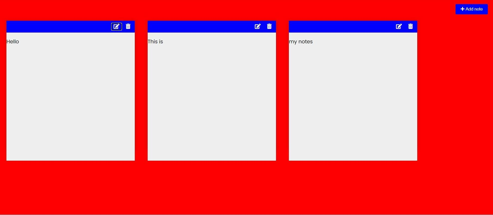

# DannyNoteTaker Web App
This project is a web application which was deployed in Microsoft Azure Cloud 
On this application users are able to add and delete their notes which was done so using JavaScript functions.
HTML was used to provide a border for users to type in their notes while CSS was used to add color to the buttons and background.

The link to this project: https://dannynotetakerwebapp.azurewebsites.net/

# Result of what the user sees when opening the app

# Result of what the user sees when interacting with the app

