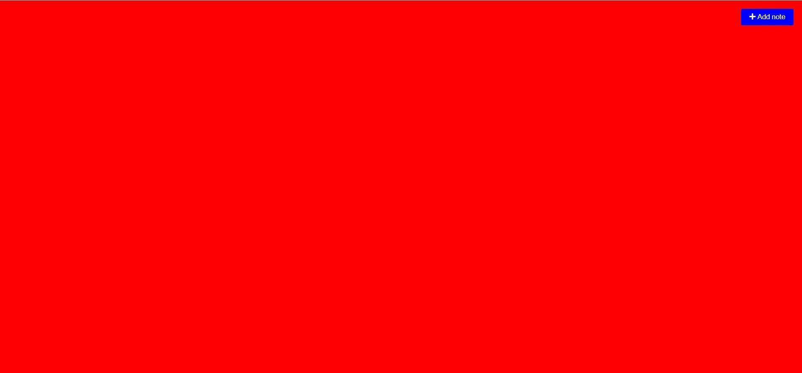

# DannyNoteTaker Web App

# About

For this project, my goal is to build a Note Taking App for myself using HTML, CSS, and JavaScript
                            
In this project, users are able to add and delete their notes on the Web app itself
                         
There is an "Add" button to create a note, a "trash can" button to delete the note, and an "pencil" button to save their note

# Documentation

HTML is used to for the overall design of the web application ranging from the buttons to the entire border of the screen.

CSS is used for the aesthetic of the web application, adding color to the buttons and border
                         
JavaScript functions are used to allow users to add, delete and update their notes
                  
The link to this project: 

## https://dannynotetakerwebapp.azurewebsites.net/

# Result of what the user sees when opening the app

# Result of what the user sees when interacting with the app

